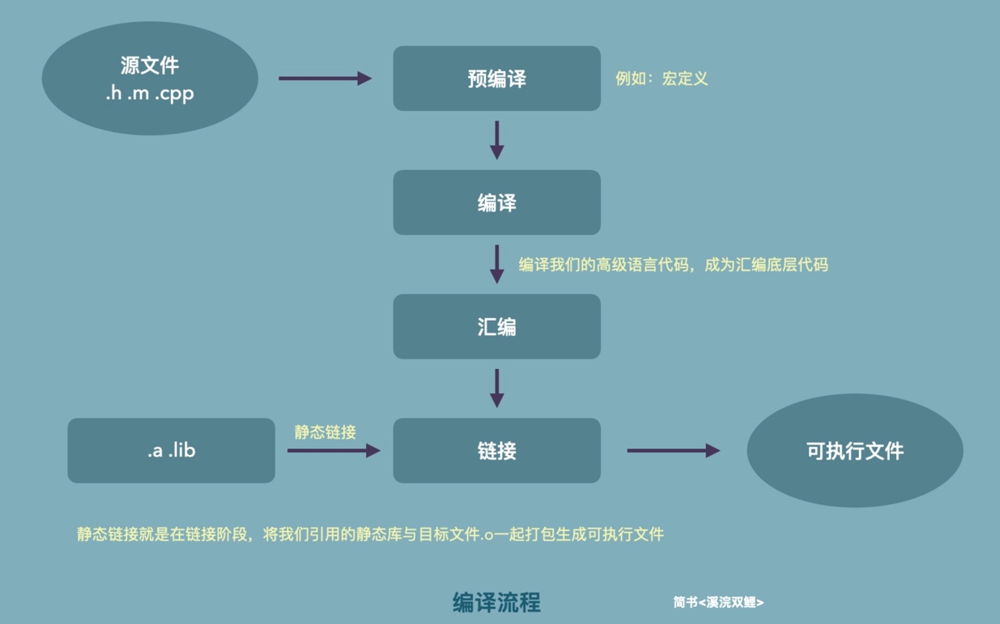
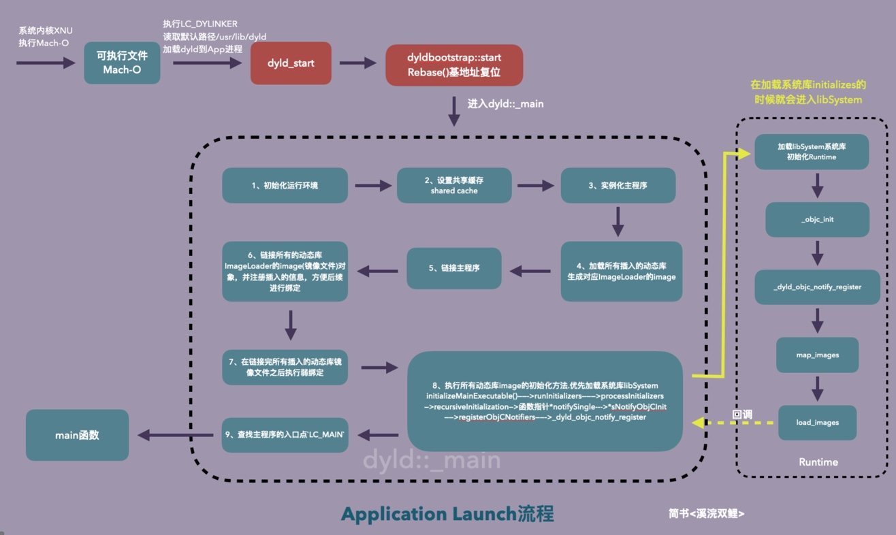
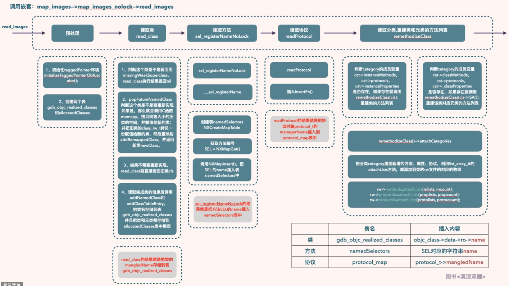
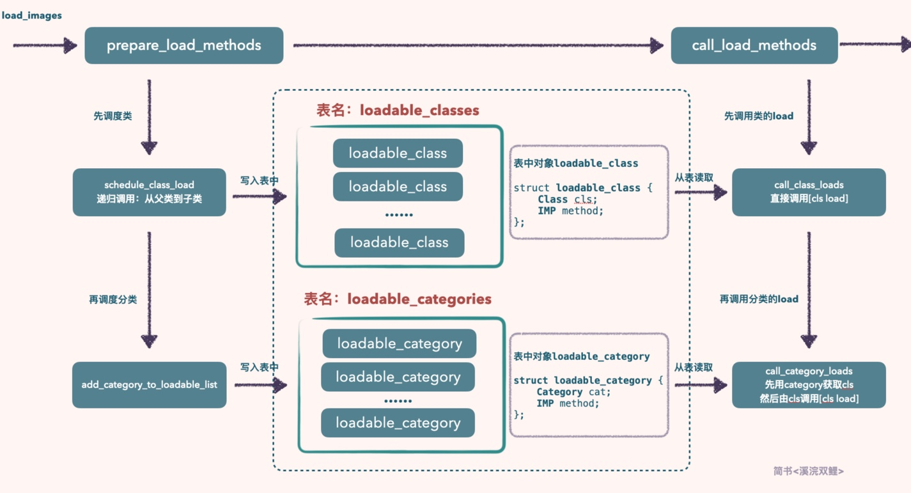

### 应用程序启动 在main函数之前都具体做了哪些内容？

main()之前通过调用`dyld`对主程序运行环境初始化，生成`imageLoader`把动态库生成对应的镜像文件（`image`），载入到内存中，然后进行链接绑定，接着初始化所有动态库，在执行所有插入的动态库初始化的时候，同时也对`load_images`进行了绑定。

执行初始化这个过程中，会优先初始化系统库`libSystem`，运行起来`Runtime`，这个过程会进入Runtime的入口函数`_objc_init`，接下来把之前链接的动态库及符号都交给Runtime进行`map_images`和`load_images`操作，然后Runtime执行完`load_images`之后会回调到dyld内部，dyld收到信息回调后，最后查找`main`函数的入口`LC_MAIN`，找到后就会调用`main`函数，进入我们开发者的代码。

1. compile

2. app launch

#### `map_images`流程分析

1. 判断`firstTime`，`firstTime`为YES，则执行环境初始化的准备，为`NO`就不执行
2. 计算class数量，根据总数调整各种表的大小并做了GC相关逻辑处理(不支持GC则打印提示信息)
3. 判断`firstTime`，`firstTime`为YES，执行各种表初始化操作，为NO则不执行
	* `sel`方法表
4. 执行`_read_images`进行读取，调用`_read_images`，最后将`firstTime`置为NO
5. `_read_images`主要做了：
	* 重新初始化TaggedPointer环境（只执行1次）
	* 开始遍历头文件，进行类与元类的读取操作并标记（旧类改动后会生成新的类，并重映射到新的类上）
	* 读取@selector方法并注册
	* 读取协议protocol
	* 处理分类，将分类信息（属性、方法、协议）attach到相关类、元类中；

#### `load_images `流程分析

主要调用了以下两个函数：

1. `prepare_load_methods `
2. `call_load_methods `

关于`prepare_load_methods`函数：

* 先处理非懒加载类：按照先父类再子类的顺序，递归地把类和类的load方法整合成一个结构体对象`loadable_class`，然后把这个结构体对象存到表`loadable_classes`中。
* 再处理非懒加载分类：
	* 重新附加非懒加载分类信息：所以非懒加载分类的同名方法会先调用（无视懒加载分类的编译顺序）
	* 获取分类的load方法，把分类和分类的load方法整合成一个结构体对象`loadable_category`，然后存储到表`loadable_categories`中。

关于`call_load_methods`函数：先调用表`loadable_classes`的`+load`方法，再调用表`loadable_categories`的`+load`方法

### 参考

* [溪浣双鲤：深入App启动之dyld](https://www.jianshu.com/p/ea680941e084) 
* [iOS探索 分类、类拓展的加载过程](https://juejin.cn/post/6844904072403910664#heading-5)