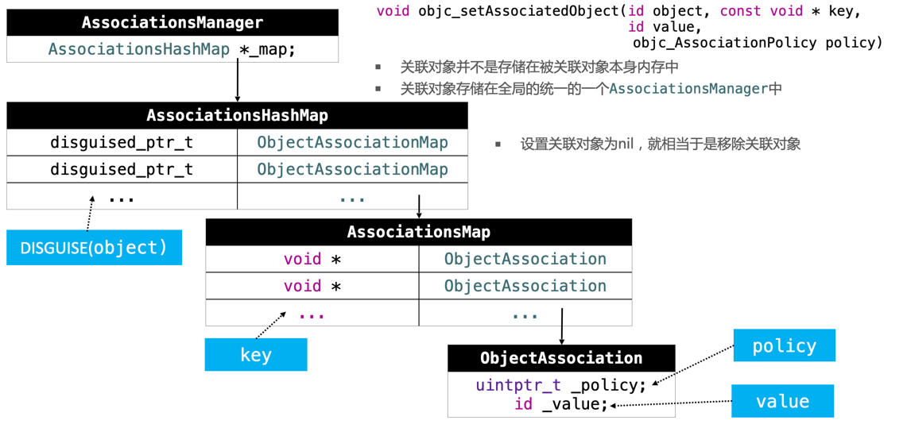

Note. 以下问题都基于64bit环境

## 1. OC对象的本质

OC的对象、类，主要是基于C\C++的结构体实现的

> 将OC代码转换为C\C++代码：

````c
xcrun -sdk iphoneos clang -arch arm64 -rewrite-objc OC源文件 -o 输出的CPP文件
````

如果需要链接其他框架，使用-framework参数，比如：-framework UIKit

### 001、一个NSObject对象占用多少内存？

* 系统分配了16个字节给NSObject对象（通过`malloc_size`函数获得）
* 但是NSObject对象内部只使用了8个字节的空间（通过`class_getInstanceSize`函数获得）。

> 源码分析如下：  
> 
> * 关于`class_getInstanceSize`函数，实际上是获取类的成员变量占用的内存大小（指针大小的倍数，向上取整，其实就是内存对齐后的大小）；
* 关于`malloc_size`函数，其获取的是类的实例对象所占用的内存大小，即类在`alloc`时系统分配的内存大小；
	* `alloc`底层调用的是`_class_createInstanceFromZone`函数，该函数通过`cls->instanceSize`获取类的size，而`instanceSize`对size做了额外处理：如果`size < 16`，令`size = 16`。也就是说，类在`alloc`时，系统会为其分配至少`16个字节`的内存。

sizeof(类型)：不是函数，是个运算符，编译期编译时就计算好了。（可以类比`#define`）

### 002、一个OC对象在内存中是如何布局的？

````
struct NSObject_IMPL {
	Class isa;
}

struct Persion_IMPL {
	struct NSObject_IMPL Student_IVARS;
	int _age;
}

struct Student_IMPL {
	struct Persion_IMPL Persion_IVARS;
	int _age;
}
````

* 内存的大端、小端模式  
* x/4xg：读取内存/4 16进制 8字节
* 内存对齐：结构体的最终内存大小，必须是最大成员大小的倍数

### 003、alloc内存分配

````c
@interface Person : NSObject
{
    int _no;        // 4
    int _age;       // 4
    int _height;    // 4
}// 8 + 12 = 20，实际是24（class_getInstanceSize([Person class])）

@end

@implementation Person

@end

int main(int argc, const char * argv[]) {
    @autoreleasepool {
        NSLog(@"%zd", class_getInstanceSize([Person class]));        // 24
        NSLog(@"%zd", malloc_size((__bridge void *)[Person alloc])); // 32
    }
    return 0;
}
````	


> 说明：底层是调用`calloc`申请内存
> 
> 1. 在调用`calloc`之前，先获取`size`（此时，通过结构体内存对齐计算得出，同时OC又做了最少16字节的调整）
> 2. 调用`calloc`向系统申请内存时，再次对`size`进行处理，进行`内存对齐`（与`1`中的对齐不一样，iOS系统做了限制，内存分配是16的倍数）：
> 	* `buckets size`：{16, 32, 48, 64, 80, 96, 112, ... , 256}
> 	* 有好几种`malloc`方式：如`malloc.c`、`nano_malloc.c`、`magazine_malloc.c`等等

### 004、OC对象的分类

* instance对象（实例对象）：通过类alloc出来的对象
	* 只存储成员变量（`isa`、其他成员变量）
	
> 特点：`isa`是第一个成员变量，因此`isa`的地址也就是实例对象的地址。

* class对象（类对象），其存储了：
	* isa指针
	* superClass指针
	* 类的属性信息（@property）
	* 类的对象方法信息（instance method） 
	* 类的协议信息（protocol）
	* 类的成员变量信息（ivar）：描述信息，即类型、名称，不是成员变量的值（值由实例对象决定）
	* ...

> * 一个类的类对象在内存中只有一份！

可通过以下方法获取类对象

````c
NSObject *obj = [[NSObject alloc] init];
Class c1 = [obj class];
Class c2 = object_getClass(obj);
Class c3 = [NSObject class];
````

* meta-class对象（元类对象），元类对象 和 类对象 的内存结构是一样的，但是用途不一样，在内存中存储的信息主要包括：
	* isa指针
	* superClass指针
	* 类的类方法信息（class method）
	* 有但不存储（null）：类的属性、对象方法信息、协议信息、成员变量信息
	* ...
	
> * 每个类有且只有一个元类对象

其相关操作方法：

````c
// 获取元类对象
Class c1 = object_getClass([NSObject class]); // 传入类对象，可获得元类对象

// 查看是否为meta-class对象
BOOL result = class_isMetaClass([NSObject class]); // NO
````

### 005、对象的isa指针指向哪里


1. 问：对象的isa指针指向哪里？
	* `instance对象（实例对象）`的isa指向`class对象（类对象）`
	* `class对象（类对象）`的isa指向`meta-class对象（元类对象）`
	* `meta-class对象（元类对象）`的isa指向`基类的meta-class对象（元类对象）`
2. 问：OC的类信息存放在哪里
	* 对象方法、属性、成员变量、协议信息，存放在`class对象（类对象）`；
	* 类方法，存放在`meta-class对象（元类对象）`；
	* 成员变量的具体值，存放在`instance对象（实例对象）`

## 2. KVO

**KVO：Key-Value Observing 键值监听**

````c
// 假设对person对象age进行KVO
Person *person = [[Person alloc] init];
...
````

### 006、iOS用什么方式实现对一个对象的KVO？（即KVO的本质是什么？）

其本质是：

1. （利用OC的RuntimeAPI）运行时动态创建 `NSKVONotifying_Person类`（同时也创建了`NSKVONotifying_Person元类`）：
	* 该类的 `superClass` 是 `Person类`；
	* `person对象` 的 `isa` 指向该类；
	* 重写添加监听属性的setter方法（令其IMP指向Foundation框架的`_NSSetXXXValueAndNotify`函数），
	* 该类还创建了`-class`、`-dealloc`、`-isKVOA`三个方法
2. 当修改实例对象的属性时，会调用Foundation框架的`_NSSetXXXValueAndNotify`函数，该函数的伪代码如下：
	* 首先调用`-willChangeValueForKey:`
	* 然后调用父类的setter方法
	* 最后调用`-didChangeValueForKey:`
		* 此方法内部会触发监听器（Observer）的监听方法（observeValueFoeKeyPath:ofObject:change:context:）

> 值得注意的是：
> 
> * `object_getClass(person);` 返回的是 `NSKVONotifying_Person类`
> * `[person class];` 返回的仍然是 `Person类`

那么，为何要重写`-class`方法呢？

如果不重写，将返回`NSKVONotifying_Person类`，重写后返回的是`Person类`。由此，**猜测是要屏蔽内部实现，隐藏`NSKVONotifying_Person类`。**

> 关于`_NSSetIntValueAndNotify`函数的说明，该函数是Foundation框架中的，用于setInt，类似的还有setChar、setDouble、setLong、setObject、setRect等等

### 007、如何手动触发KVO？

如下：

````c
[self.person willChangeValueForKey:@"age"];
[self.person didChangeValueForKey:@"age"];
````

### 008、直接修改成员变量会不会触发KVO？为什么？

不会！因为KVO的本质是修改了属性的setter方法（令其IMP指向Foundation框架的`_NSSetXXXValueAndNotify`函数），而直接修改成员变量没有调用setter方法。

## 3、KVC

**KVC：Key-Value Coding 键值编码**，可以通过一个key来访问某个属性

常见的API：

* -setValue:forKey:
* -setValue:forKeyPath:
* -getValueForKey:
* -getValueForKeyPath:

### 009、通过KVC修改属性会触发KVO吗？

会触发！

### 010、KVC的赋值和取值过程是怎样的？原理是什么？

* setter：


* getter：


## 4、Category

`category_t`（分类结构体）结构如下：

````c
struct _category_t {
	const char *name;		// 类名
	struct _class_t *cls;	// 类
	const struct _method_list_t *instance_methods; // 实例方法列表
	const struct _method_list_t *class_methods;	// 类方法列表
	const struct _protocol_list_t *protocols;		// 协议列表
	const struct _prop_list_t *properties;			// 属性列表
}
````

### 011、Category的应用场景

应用比较广泛，比如合成图片：合成等级图片、合成渐进色图片等

### 012、Category的实现原理

* Category编译完成后的底层结构是`struct category_t`（每个分类都是这样的结构体对象），里面存储着分类的对象方法、类方法、协议等信息；
* 程序运行的时候，runtime会把分类结构体对象中的信息合并到类信息中（类对象、元类对象）；

#### 分类的加载处理流程：

* 源码解读顺序：

````c
* objc-os.mm
	* _objc_init
	* map_images
	* map_images_nolock
* objc-runtime-new.mm
	* _read_images
	* remethodizeClass
	* attachCategories
	* attachLists
		* realloc、memmove、memcopy
````

* 解读如下：
	* 在`attachCategories`中，把所有Category的方法列表（属性列表、协议列表）各自合并到一个大二维数组中；
		* 合并顺序与编译顺序相反，即后面参与编译的Category数据，会在数组的前面
			* `while (i--) {...}` 
	* 在`attachLists`中，把二维数组中的分类数据（方法、属性、协议），插入到类原来数据的前面；
		* 先`realloc`一块新内存
		* 再用`memmove`把类原来的数据挪到最后；
		* 最后用`memcopy`把分类的数据copy到前面；
	* 至此，分类的数据全部都附加到类中！

* `memmove`和`memcopy`区别
	* 都是C语言的库函数，作用都是拷贝一定长度的内存的内容；
	* 当内存重叠时（目标内存与源内存），`memmove`保证拷贝的结果是正确的，`memcopy`不保证拷贝的结果的正确性；
		* 因为`memmove`有比较两块内存的地址大小，决定是向前（or 向后）移动拷贝，而`memcopy`是直接向后拷贝；

### 013、Category和Extension的区别是什么？

* `Extension`在编译的时候，它的数据就已经包含在类信息中；
* `Category`是在运行时，才会将数据合并到类信息中；

### 014、类与分类的同名方法的调用顺序？

由上面「分类的加载流程」可得出「同名方法的调用优先级」：

* 优先去分类中找：按编译顺序逆序查找
	* 非懒加载分类（实现了`+load`）的优先级大于编译顺序
	* 如果有多个非懒加载分类，此时再按编译顺序逆序查找 
* 没有再去类中找

#### load方法自动调用源码解读

* 源码解读顺序

````c
* load_images
* prepare_load_methods
	* schedule_class_load
	* add_class_to_loadable_list
	* add_category_to_loadable_list
* call_load_methods
	*  call_class_loads
	*  call_category_loads
	*  (*load_method)(cls, SEL_load);
````

系统调用`+load`方法：是根据方法地址直接调用，并不是经过`objc_msgSend`函数间接调用
	* 严格意义上，开发者是可以手动调用`+load`方法，此时是走`objc_msgSend`消息发送流程，不过一般不推荐！！；

* 小结：
	* `+load` 方法会在runtime加载类、分类时（非懒加载->`load_images`）由系统自动调用；
	* 每个类、分类的`+load`方法，仅自动调用1次；
	* 调用顺序：
		* a). 先调用类的`+load`
			* 按照编译先后顺序调用（先编译，先调用）
			* 调用子类的`+load`前先调用父类的`+load`
		* b). 再调用分类的`+load`
			* 按照编译先后顺序调用（先编译，先调用）

### 015、Category中有load方法吗？load方法是什么时候调用的？load方法能继承吗？

* 有`load`方法
* `load`方法在runtime加载类、分类时调用；
* `load`方法可以继承，但是一般情况下不会主动去调用`load`方法，而是让系统自动调用。

#### initialize（初始化）源码解读

* 源码解读顺序

````c
* class_getInstanceMethod
* lookUpImpOrNil
* lookUpImpOrForward
* _class_initialize
* callInitialize
* objc_msgSend(cls, SEL_initialize)
````

* `+initialize`小结：
	* 调用时机：`+initialize`方法会在类第一次接收到消息时调用；
	* 调用方式：通过`objc_msgSend`消息机制调用；
	* 调用顺序：
		* 先初始化父类；
		* 再初始化子类（可能最终调用的是父类的`+initialize`方法）

### 016、load、initialize方法的区别是什么？它们在Category中的调用顺序？以及出现继承时它们之间的调用过程？

1. 调用方式的不同：
	* `+load`是根据函数地址直接调用；
	* `+initialize`是通过`objc_msgSend`调用；
2. 调用时机的不同：
	* `+load`是runtime加载类、分类的时候调用；
	* `+initialize`是类第一次接收到消息时调用，每一个类只会`initialize`一次（父类的`initialize`方法可能会被调用多次）
3. 调用顺序的不同：
	* `+load`：
		* a). 先调用类的`+load`
			* 按照编译先后顺序调用（先编译，先调用）
			* 调用子类的`+load`前先调用父类的`+load`
		* b). 再调用分类的`+load`
			* 按照编译先后顺序调用（先编译，先调用）
	* `+initialize`：
		* 先初始化父类；
		* 再初始化子类（可能最终调用的是父类的`+initialize`方法）

### 017、Category能否添加成员变量？如果可以，如何给Category添加成员变量？

不能直接给Category添加成员变量，但是可以通过 **关联对象** 间接实现Category有成员变量的效果

属性：`@property`编译后，编译器主要做了3件事：

1. 生成`_propertyName`的成员变量；
2. 生成该变量相关的`setter`、`getter`方法声明；
3. 生成该变量相关的`setter`、`getter`方法实现；

而分类中的`@property`，只做了上述的「第2」件事！

#### 关联对象（Associate）

* 常用API

````c
1). static char MyKey;
objc_setAssociatedObject(obj, &MyKey, value, OBJC_ASSOCIATION_RETAIN_NONATOMIC)
objc_getAssociatedObject(obj, &MyKey)

2). 使用get方法的@selecor作为key
objc_setAssociatedObject(obj, @selector(getter), value, OBJC_ASSOCIATION_RETAIN_NONATOMIC)
objc_getAssociatedObject(obj, @selector(getter))
````

* 底层原理


