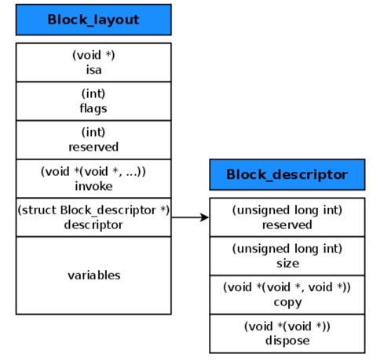
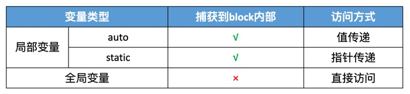
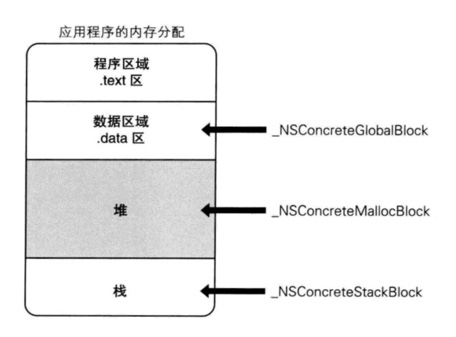
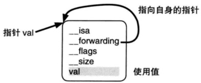
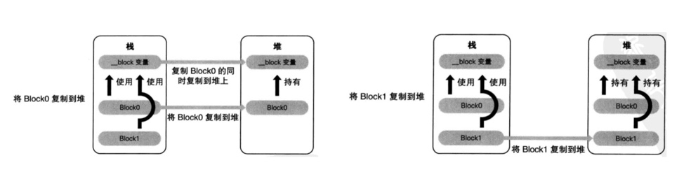
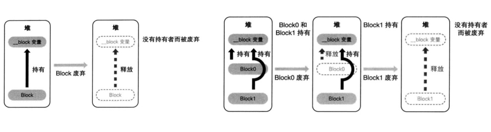
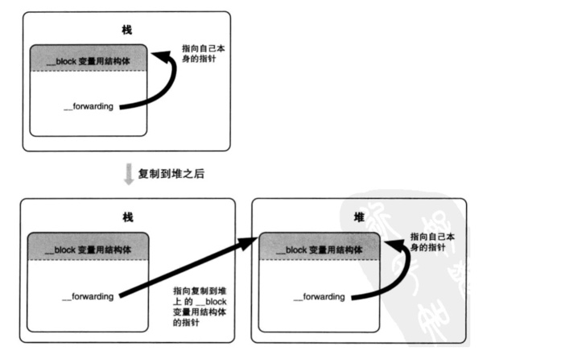

## 相关面试题

### 01、block的原理是怎样的？本质是什么？

* block本质是OC对象，它有isa指针；
* block是封装了函数调用以及函数调用环境的OC对象

### 02、__block的作用是什么？有什么使用注意点？

见下方：[5、__block修饰符](#5、__block修饰符)

### 03、block的属性修饰词为什么是copy？使用block有哪些注意点？

* block一旦没有进行copy操作，就不会在堆上；
* 其实在ARC下，copy和strong的效果是一样的；在MRC下两者是不同的（copy会对block进行拷贝操作；strong则不会，需要开发者手动copy），使用copy是沿用MRC的习惯
* 注意循环引用问题！循环引用的解决方案：
	* 最优：`__weak`
	* 有缺陷的方案：`__unsafe_unretained`（不会自动置nil，有可能导致野指针异常）
	* 有缺陷的方案：`__block`（block内部把变量置为nil，需要调用block）

### 04、block在修改NSMutableArray时，需不需要添加__block？

只要修改的不是NSMutableArray本身的指针地址，就不需要添加__block；

## block

### 1、block本质

* `block`本质上也是一个OC对象，它有isa指针；
	* 打印block的继承链：`__NSMallocBlock__` : `__NSMallocBlock` : `NSBlock` : `NSObject`
* 具体地说，`block`是封装了函数调用以及函数调用环境的OC对象；
* `block`结构主要包含：
	* isa指针
	* 函数调用地址
	* block描述结构体：
		* block内存大小
		* copy函数地址（捕获了指针对象，对该对象的内存管理，相当于retain；基本类型变量没有该函数）
		* dispose函数地址（捕获了指针对象，对该对象的内存管理，相当于release；基本类型变量没有该函数）
	* block捕获的变量

`block`结构如图所示：

### 2、block的变量捕获（capture）

为了保证`block`内部能够访问外部的变量，`block`有个变量捕获机制：

当block内部访问了对象类型的auto变量时：

* 如果block在栈上，将不会对auto变量产生强引用；
* 如果block被拷贝到堆上时，会调用block内部的copy函数，copy函数内部会调用`_Block_object_assign`函数，该函数会根据auto变量的修饰符（`__strong`、`__weak`、`__unsafe_unretained`）做出相应的操作，形成强引用（retain）或者弱引用；
* 当block从堆上被移除时，会调用block内部的`dispose`函数，`dispose`函数内部会调用`_Block_object_dispose`函数，该函数会自动释放引用的auto变量；

### 3、block的类型

主要有3种类型：

* `__NSGlobalBlock__` （ _NSConcreteGlobalBlock ）：没有访问auto变量
* `__NSStackBlock__` （ _NSConcreteStackBlock ）：访问了auto变量
* `__NSMallocBlock__` （ _NSConcreteMallocBlock ）：`__NSStackBlock__`调用了copy

### 4、block的copy

每一种类型的block调用copy后的结果如下：

| block分类 | 副本源的配置存储域 | 复制结果 |
| --- | --- | --- |
| _NSConcreteGlobalBlock | 程序的数据段 | 什么也不做 |
| _NSConcreteStackBlock | 栈 | 从栈复制到堆 |
| _NSConcreteMallocBlock | 堆 | 引用计数增加 |

在ARC环境下，编译器会根据情况自动将栈上的block复制到堆上，比如以下情况：

* block作为函数返回值时；
* 将block赋值给__strong指针时；
* block作为Cocoa API中方法名含有usingBlock的方法参数时；
* block作为GCD API的方法参数时

### 5、__block修饰符

* `__block`用于解决block内部无法修改auto变量值的问题；
* `__block`不能修饰全局变量、静态变量（static）；
* 编译器会将`__block`修饰的变量包装成一个对象，其结构如下图：

#### 5.1、__block的内存管理

* 当block在栈上时，并不会对`__block`变量产生强引用；
* 当block被copy到堆上时，会调用block内部的copy函数，copy函数内部会调用`_Block_object_assign`函数，该函数会对`__block`变量形成强引用（retain）或弱引用；
	* 如果`__block`修饰的是对象变量，则需要再判断对象的修饰符（`__strong`、`__weak`、`__unsafe_unretained`），再决定对该变量形成强引用还是弱引用；
	* 如果是基本类型变量，`_Block_object_assign `函数对变量形成强引用；
* 当block从堆上被移除时，会调用block内部的`dispose`函数，`dispose`函数内部会调用`_Block_object_dispose`函数，该函数会自动释放引用的`__block`变量；

> 类比block访问auto局部变量

如图所示：

#### 5.2、__block的__forwarding指针

