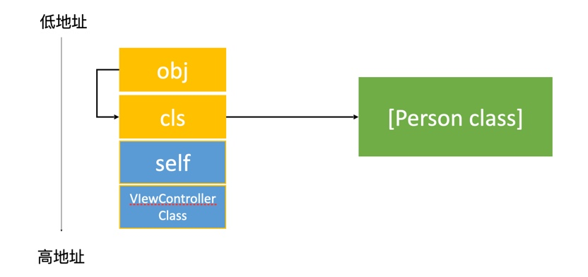
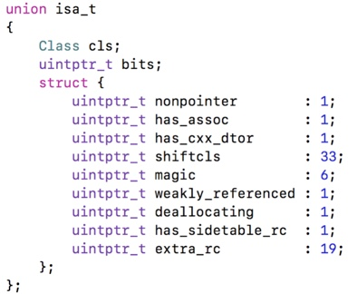
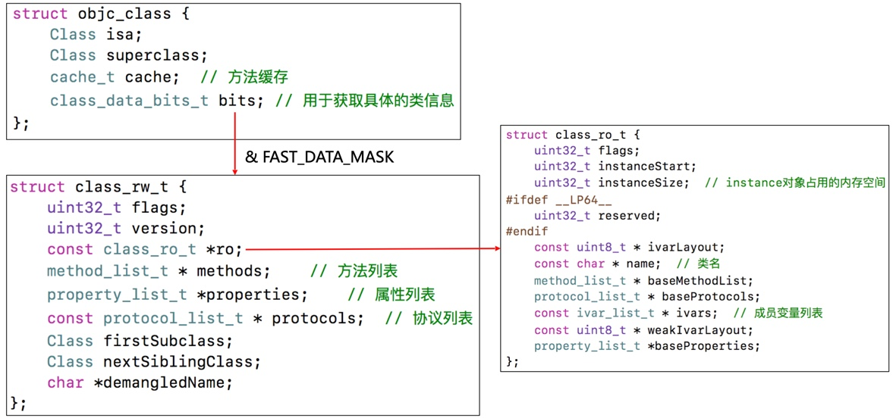
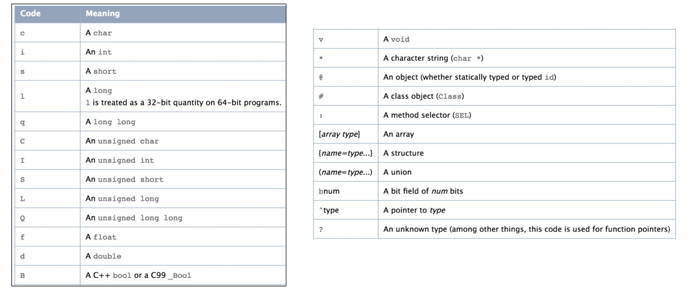
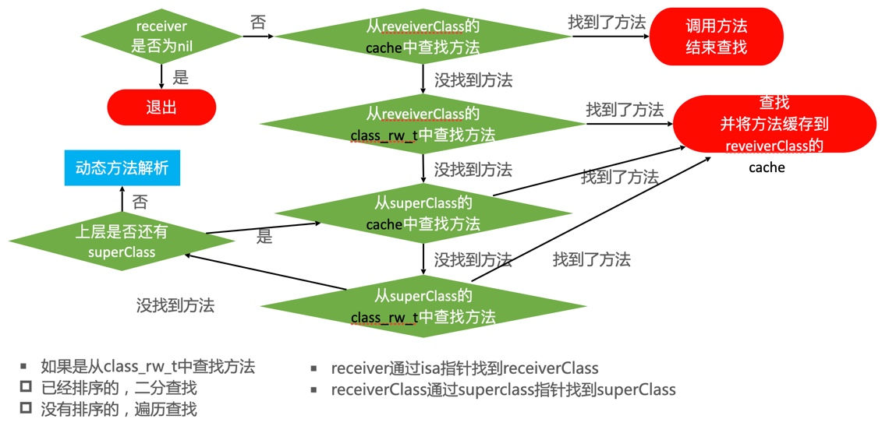
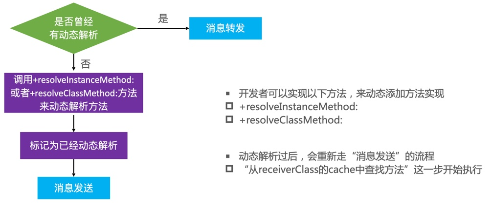
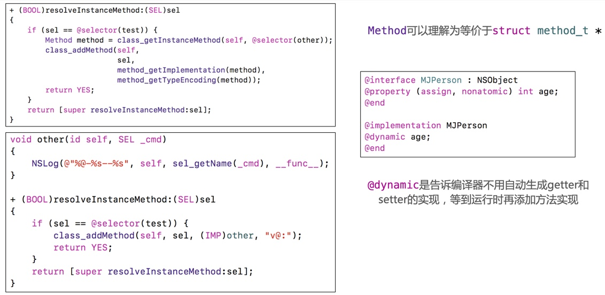
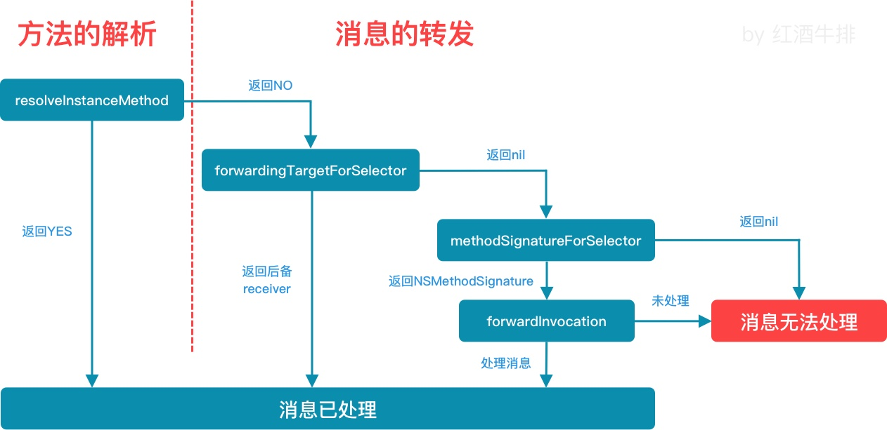

## Runtime

### 面试题

#### 01、讲一下OC的消息机制

* OC中的方法调用其实就是转成`objc_msgSend`（`objc_msgSendSuper2`）函数的调用，给`receiver`发送了一条消息（selector方法名）；
* `objc_msgSend`底层有3大阶段：见下方 >

#### 02、什么是runtime？平时项目中有用过吗？

* OC是一门动态性比较强的编程语言，允许很多操作推迟到程序运行时再进行；
* OC的动态性都是由Runtime来支撑和实现的，Runtime是一套API（源码由C、C++和汇编编写），封装了很多动态性相关的函数；
* 平时编写的OC代码，底层都是转换成Runtime API进行调用；

runtime应用：

* 利用关联对象（AssociatedObject）给分类添加属性；
* 遍历所有的属性或者成员变量：（修改UITextField占位文字的颜色、字典转模型等）
* 交换方法实现
	* `class_replaceMethod`
	* `method_exchangeImplementations`

#### 03、打印结果是什么？

````c
@interface Person : NSObject
@end

@interface Student : Person
@end

@implementation Student

- (instancetype)init
{
	if (self = [super init]) {
		NSLog(@"[self class] = %@", [self class]);
		NSLog(@"[super class] = %@", [super class]);
		NSLog(@"[self superclass] = %@", [self superclass]);
		NSLog(@"[super superclass] = %@", [super superclass]);
	}
	return self;
}

@end
````

结果是：

````c
Student
Student
Person
Person
````

#### 04、打印结果是什么？

````c
@interface Person : NSObject
@end

- (void)kindAndMember
{
	BOOL res1 = [[NSObject class] isKindOfClass:[NSObject class]];
	BOOL res2 = [[NSObject class] isMemberOfClass:[NSObject class]];
	BOOL res3 = [[Person class] isKindOfClass:[Person class]];
	BOOL res4 = [[Person class] isMemberOfClass:[Person class]];
	NSLog(@"%d %d %d %d", res1, res2, res3, res4);
}
````

结果是：

````c
1 0 0 0
````

解析如下：

* `isKindOf`找类簇，从「接收者」: 「接收者父类」 : ... : 「根类」
	* 类方法匹配元类
	* 实例方法匹配类
* `isMemberOf`找「接收者」本类（元类）
	* 类方法匹配元类
	* 实例方法匹配类 

#### 05、以下代码能否执行成功？如果可以，打印结果是什么？

````c
@interface Person : NSObject

@property (nonatomic, copy) NSString *name;

- (void)print;

@end

@implementation Person

- (void)print
{
	NSLog(@"my name's %@", self.name);
}

@end

@implementation ViewController

- (void)viewDidLoad
{
	[super viewDidLoad];
	
	id cls = [Person class];
	void *obj = &cls;
	[(__bridge id)obj print];
}

@end
````

````c
能执行成功！打印结果是：my name's ViewController <地址>
````

Q1：为什么能调用成功？

* `[person print]`这样调用方法的底层实现，是通过`Person`类对象找`-print`方法的`IMP`（先通过`person`实例对象存储的地址的前8个字节（即`isa`），进行 `& ISA_MASK`运算后，得到`Person`类对象的地址，再去查找`-print`方法，找到即调用；
* 题目中`[(__bridge id)obj print];`这样调用，也会拿到`obj`存储的地址的前8个字节（即`Person`类对象），进行`& ISA_MASK`运算后，得到的还是`Person`类对象的地址（没有变化），再找到`-print`方法，继而调用；

Q2：为什么打印了ViewController等对象内容？

* 栈空间内存如下：


### 知识点

#### 1、runtime

* OC是一门动态性比较强的编程语言，允许很多操作推迟到程序运行时再进行；
* OC的动态性都是由Runtime来支撑和实现的，Runtime是一套API（源码由C、C++和汇编编写），封装了很多动态性相关的函数；
* 平时编写的OC代码，底层都是转换成Runtime API进行调用；

#### 2、isa指针详解

* 在arm64架构之前，isa就是一个普通的指针，存储着类对象（或元类对象）的内存地址；
* 从arm64架构开始，对isa进行了优化，isa就变成了一个共用体（union）结构，同时还使用位域来存储更多的信息。如图所示：



说明如下：

* `nonpointer`
	* 0：代表普通的指针，存储着类对象（或元类对象）的内存地址；
	* 1：代表优化过，使用位域存储更多的消息；
* `has_assoc`：是否设置过关联对象，如果没有，释放时会更快；
* `has_cxx_dtor`：是否有C++的析构函数（`.cxx_destruct`） ，如果没有，释放时会更快；
* `shiftcls`：存储着类对象（或元类对象）的内存地址；
* `magic`：用于在调试时分辨对象是否未完成初始化；
* `weakly_referenced`：是否有被弱引用指向过，如果没有，释放时更快；
* `deallocating`：是否正在释放；
* `has_sidetable_rc`：引用计数是否过大而无法存储在isa中，如果为1，那么引用计数会存储在一个叫SideTable的类的属性中；
* `extra_rc`：里面存储的值是引用计数减1；

> `isa & ISA_MASK`得到具体的类对象（或元类对象）指针；

#### 3、Class的结构

如下图所示：



#### 4、`class_rw_t`与`class_ro_t`

* `class_rw_t`里面的方法列表、属性列表、协议列表都是二维数组，是可读可写的，包含了类的初始内容、分类的内容；
* `class_ro_t`里面的方法列表、属性列表、协议列表、成员变量列表都是一维数组，且是只读的，包含了类的初始内容（在编译期就确定的）；

#### 5、`method_t`

`method_t`是对方法（函数）的封装，其结构如下：

````c
struct method_t {
	SEL name; // 函数名
	const char *types; // 编码（返回值类型、参数类型）
	IMP imp; // 指向函数的指针（函数地址）
}
````

`SEL`表示方法（函数）名，一般叫做选择器，底层结构与`char *`类似：

* 可以通过`@selector()`和`sel_registerName()`获得；
* 可以通过`sel_getName()`和`NSStringFromSelector()`转成字符串；
* 不同类中的同名方法，所对应的方法选择器是相同的；

`types`是OC对方法（函数）的编码字符串，包含了函数返回值类型、参数类型，如`v16@0:8`；

* iOS中提供了一个叫做`@encode`的指令，可以将具体的类型表示成字符串编码；



#### 6、方法缓存`cache_t`

Class内部结构中有个方法缓存（`cache_t`），用散列表（哈希表）来缓存曾经调用过的方法，可以提高方法的查找速度；

其结构如下：

````c
struct cache_t {
	struct bucket_t *_buckets; 	// 散列表
	mask_t _mask;				// 散列表的长度-1
	mask_t _occupied; 			// 已缓存的方法数量
}

struct bucktet_t {
	cache_key_t _key;	// sel作为key
	IMP _imp;			// 函数的内存地址
}
````

相关说明：

* 初始`_buckets`长度为4，扩容临界点为长度的`3/4`，当新的缓存数大于临界点时，执行扩容（之前容量的两倍），同时清除以前的缓存方法，只保留即将要缓存的方法；
	* 如果容量超过了`uint32_t`大小（4字节）时，则重新申请跟原来一样大小的容量，清除已缓存的，只保留即将要缓存的方法；

**多线程对方法缓存的影响：**

* 多线程同时读：在整个`objc_msgSend`函数中，为了达到最佳的性能，对方法缓存的读取操作是没有添加任何锁的。而多个线程同时调用已缓存的方法，并不会引发`_buckets`和`_mask`的变化，因此多个线程同时读取方法缓存的操作是不会有安全隐患的。
* 多线程同时写：在桶数量扩容和写桶数据之前，系统使用了一个全局的互斥锁（`cacheUpdateLock.assertLocked()`）来保证写入的同步处理，并且在锁住的范围内部还做了一次查缓存的操作（`if (cache_getImp(cls, sel)) return;`），这样就 **保证了哪怕多个线程同时写同一个方法的缓存也只会产生写一次的效果，即多线程同时写缓存的操作也不会有安全隐患**。
* 多线程同时读写：
	* 读缓存（`CacheLookup `）的汇编代码中，第一条指令就是读取`cache_t`中的数据，且后续没有再次读取，而CPU能保证单条指令执行的原子性，因此只要保证最开始读取的`_buckets`和`_mask`是相互匹配的（即要么同时是扩容前的数据，要么同时是扩容后的数据），那么多个线程同时读写方法缓存也是没有安全隐患的。
	* 在`setBucketsAndMask`函数中会设计到更改`_buckets`和`_mask`的值，为了确保这个顺序不被编译器优化，这里使用了`mega_baerrier()`来实现 **编译内存屏障（Compiler Memory Barrier）**
		* **编译内存屏障** 仅仅是确保`_buckets`的赋值会优先于`_mask`的赋值，也就是说，在任何场景下当指令`ldp	x10, x11, [x16, #CACHE]`执行后，得到的`_buckets`数组的长度一定是大于或等于`_mask+1`的，如此就保证了不会出现内存数组越界导致的程序崩溃。可见，借助编译内存屏障的技巧在一定的程度上可以实现无锁读写技术。
	* 缓存的内存垃圾回收机制：在多线程读写方法缓存时，写线程可能会扩容`_buckets`（开辟新的`_buckets`内存，同时销毁旧的`_buckets`内存），此时，如果其他线程读取到的`_buckets`是旧的内存，就有可能会发生读内存异常而系统崩溃。为了解决这个问题，OC使用了内存垃圾回收机制。

**缓存的内存垃圾回收机制：**
	
* OC使用了两个全局数组`objc_entryPoints`、`objc_exitPoints`，分别保存所有会访问到`cache`的函数的起始地址、结束地址

````c
extern "C" uintptr_t objc_entryPoints[];
extern "C" uintptr_t objc_exitPoints[];
````

下面列出这些函数（以`arm64`架构汇编为例）

````c
.private_extern _objc_entryPoints
_objc_entryPoints:
	.quad   _cache_getImp
	.quad   _objc_msgSend
	.quad   _objc_msgSendSuper
	.quad   _objc_msgSendSuper2
	.quad   _objc_msgLookup
	.quad   _objc_msgLookupSuper2
	.quad   0

.private_extern _objc_exitPoints
_objc_exitPoints:
	.quad   LExit_cache_getImp
	.quad   LExit_objc_msgSend
	.quad   LExit_objc_msgSendSuper
	.quad   LExit_objc_msgSendSuper2
	.quad   LExit_objc_msgLookup
	.quad   LExit_objc_msgLookupSuper2
	.quad   0
````

当线程扩容哈希桶时，会先把旧的桶内存保存在一个全局的垃圾回收数组变量`garbage_refs`中，然后再遍历当前进程（在iOS中，一个进程就是一个应用程序）中的所有线程，查看是否有线程正在执行`objc_entryPoints`列表中的函数（原理是 **PC寄存器** 中的值是否在`objc_entryPoints`和`objc_exitPoints`这个范围内），如果没有则说明没有任何线程访问`cache`，可以放心地对`garbage_refs`中的所有待销毁的哈希桶内存块执行真正的销毁操作；如果有则说明有线程访问`cache`，这次就不做处理，下次再检查并在适当的时候进行销毁。

以上，`OC 2.0`的`runtime`巧妙的利用了 **ldp汇编指令**、**编译内存屏障技术**、**内存垃圾回收技术** 等多种手段来解决多线程读写的无锁处理方案，既保证了安全，又提升了系统的性能。

#### 7、消息机制

OC的方法调用，其实就是转换为`objc_msgSend`函数的调用，该函数的执行流程（也就是消息机制），总共分为3大阶段：

* 消息发送：



* 动态方法解析：



解决方案，如：



* 消息转发：



#### 8、super的本质

* `super`的调用，底层会转换为`objc_msgSendSuper2`函数的调用，接收两个参数：
	* `struct objc_super2`结构体，其内有两个成员：
		* `id receiver`;
		* `Class current_class`;
	* `SEL`
* receiver是消息接收者；
* `current_class`是receiver的Class对象
