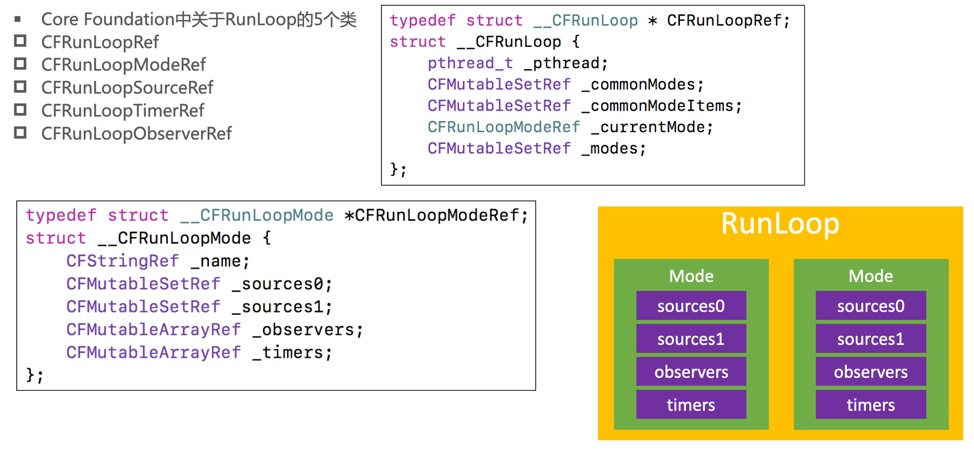
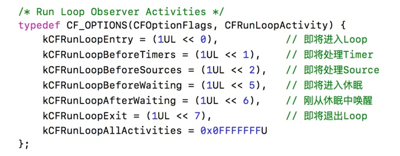
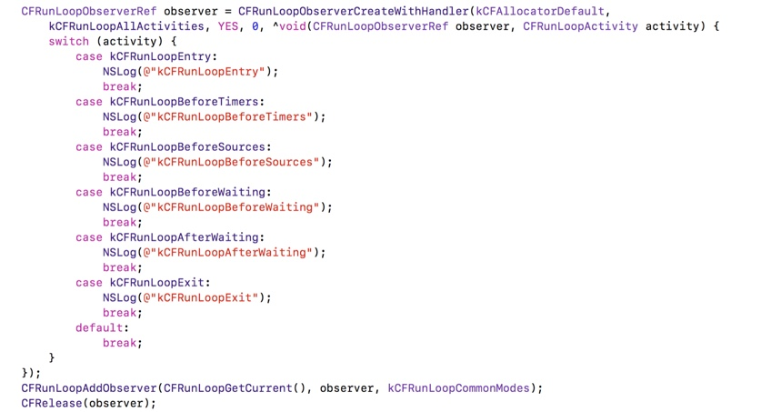
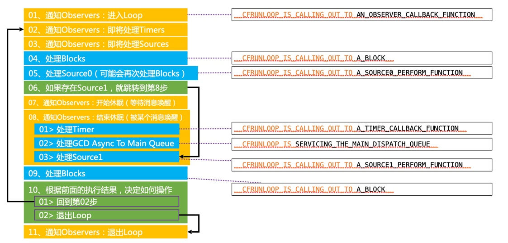
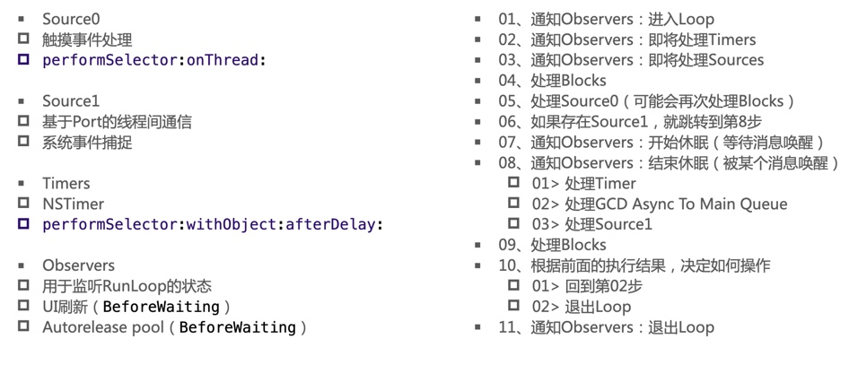
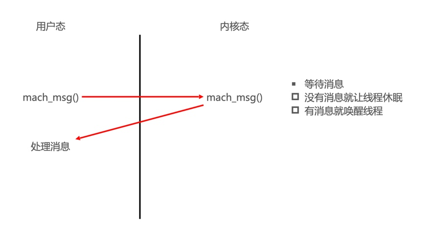

## Runloop

#### 01、讲讲 runLoop，项目中有用到吗？

* Runloop是一种运行循环，在程序运行过程中循环做一些事情，其特点：
	* 节省CPU资源，提高程序性能：没事做就休息，有事做就被唤醒处理事件：
* 可处理的事件如下：
	* 定时器（Timer）、PerformSelector
	* GCD Async Main Queue
	* 事件相应、手势识别、界面刷新
	* 网络请求
	* Autoreleasepool 

项目中用到runloop的地方：

* 控制线程生命周期（线程保活）：给线程的RunLoop添加source/timer/observer事件（如Port）
* 解决NSTimer在滑动时停止工作的问题
* 卡顿监控
* 性能优化

#### 02、runloop和线程的关系？

* 线程与runloop是一一对应关系，每条线程都有唯一的一个与之对应的RunLoop对象；
	* RunLoop保存在一个全局的Dictionary里，线程作为key，RunLoop作为value；
* 线程刚创建时并没有RunLoop对象，RunLoop会在第一次获取它时创建（是创建，并没有启用，启用需要调用专门的启用函数），RunLoop会在线程结束时销毁；
	* 主线程的RunLoop已经自动获取（创建），子线程默认没有开启RunLoop

**如何获取runloop对象？**

* Foundation：
	* 获得当前线程的RunLoop对象：[NSRunLoop currentRunLoop]; 
	* 获得主线程的RunLoop对象：[NSRunLoop mainRunLoop]; 
* Core Foundation：
	* 获得当前线程的RunLoop对象：CFRunLoopGetCurrent(); 
	* 获得主线程的RunLoop对象：CFRunLoopGetMain();

#### 03、runloop内部实现逻辑？

**Core Foundation中关于Runloop的5个类：**



* CFRunLoopModeRef代表RunLoop的运行模式
* 一个RunLoop包含若干个Mode，每个Mode又包含若干个Source0/Source1/Timer/Observer
	* 不同Mode的Source0/Source1/Timer/Observer能分隔开来，互不影响
	* 如果Mode里没有任何Source0/Source1/Timer/Observer，RunLoop会立马退出
* RunLoop启动时只能选择其中一个Mode，作为currentMode
* 如果需要切换Mode，只能退出当前Loop，再重新选择一个Mode进入Loop

**常见的两种Mode：**

* kCFRunLoopDefaultMode（NSDefaultRunLoopMode）：App的默认Mode，通常主线程是在这个Mode下运行
* UITrackingRunLoopMode：界面跟踪 Mode，用于 ScrollView 追踪触摸滑动，保证界面滑动时不受其他 Mode 影响

**RunLoop的状态：**



**RunLoop的状态监听：**



#### 04、RunLoop的运行逻辑



文字说明：



**RunLoop休眠的实现原理：**



#### 05、线程保活案例

Foundation版本：

````c

- (instancetype)init
{
    if (self = [super init]) {
        self.stopped = NO;
        
        __weak typeof(self) weakSelf = self;
        
        self.innerThread = [[MJThread alloc] initWithBlock:^{
            [[NSRunLoop currentRunLoop] addPort:[[NSPort alloc] init] forMode:NSDefaultRunLoopMode];
            
            while (weakSelf && !weakSelf.isStopped) {
                [[NSRunLoop currentRunLoop] runMode:NSDefaultRunLoopMode beforeDate:[NSDate distantFuture]];
            }
        }];
        
        [self.innerThread start];
    }
    return self;
}

````

Core Foundation版本：

````c
/** MJThread **/
@interface MJThread : NSThread
@end
@implementation MJThread
- (void)dealloc
{
    NSLog(@"%s", __func__);
}
@end

/** MJPermenantThread **/
@interface MJPermenantThread()
@property (strong, nonatomic) MJThread *innerThread;
@end

@implementation MJPermenantThread

// MARK: public methods

- (instancetype)init
{
    if (self = [super init]) {
        self.innerThread = [[MJThread alloc] initWithBlock:^{
            // 创建上下文（要初始化一下结构体）
            CFRunLoopSourceContext context = {0};
            // 创建source
            CFRunLoopSourceRef source = CFRunLoopSourceCreate(kCFAllocatorDefault, 0, &context);
            // 往Runloop中添加source
            CFRunLoopAddSource(CFRunLoopGetCurrent(), source, kCFRunLoopDefaultMode);
            // 销毁source
            CFRelease(source);
            // 启动
            CFRunLoopRunInMode(kCFRunLoopDefaultMode, 1.0e10, false);
        }];
        [self.innerThread start];
    }
    return self;
}

- (void)executeTask:(MJPermenantThreadTask)task
{
    if (!self.innerThread || !task) return;
    
    [self performSelector:@selector(__executeTask:) onThread:self.innerThread withObject:task waitUntilDone:NO];
}

- (void)stop
{
    if (!self.innerThread) return;
    
    [self performSelector:@selector(__stop) onThread:self.innerThread withObject:nil waitUntilDone:YES];
}

- (void)dealloc
{
    NSLog(@"%s", __func__);
    
    [self stop];
}

// MARK: private methods

- (void)__stop
{
    CFRunLoopStop(CFRunLoopGetCurrent());
    self.innerThread = nil;
}

- (void)__executeTask:(MJPermenantThreadTask)task
{
    task();
}

@end
````