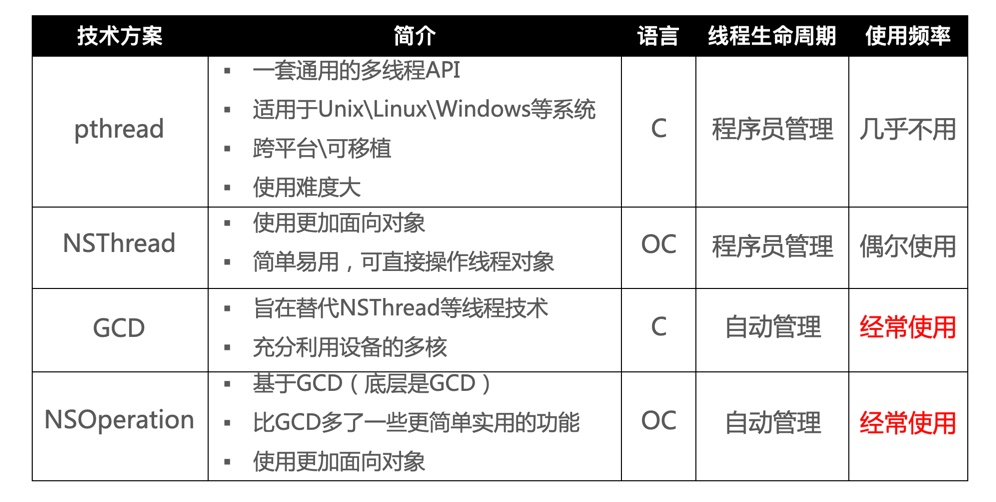
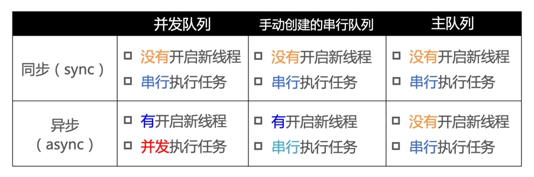

## 面试题

### 01、iOS的多线程方案有哪几种？你更倾向于哪一种？



### 02、说一说 NSOperationQueue 和 GCD 的区别，以及各自的优势？

* 两者的联系：	
	* `GCD`是底层的`C`语言的`API`
	* `NSOperation`是`OC`的类，它底层封装了`GCD`
* 两者的区别：
	* `GCD`执行效率更高，使用方便
	* `NSOperation`可以很方便地设置最大并发数、设置优先级、添加依赖关系；`GCD`的处理则相对复杂一些；
	* `NSOperation`支持`KVO`，可以检测`operation`是否正在执行、是否结束、是否取消，`GCD`无法做到这点；

### 03、请问下面的代码打印结果是什么？

````c
dispatch_queue_t queue = dispatch_get_global_queue(0, 0);
dispatch_async(queue, ^{
	NSLog(@"1");
	[self performSelector:@selector(test) withObject:nil afterDelay:.0];
	NSLog(@"3");
});

- (void)test
{
	NSLog(@"2");
}
````

* 打印结果为：1、3
* `-performSelector:withObject:afterDelay:`的本质是往`RunLoop`中添加定时器，而子线程的RunLoop默认是没有开启的；

### 06、请问下面的代码打印结果是什么？

````c
- (void)test
{
    NSLog(@"2");
}

- (void)touchesBegan:(NSSet<UITouch *> *)touches withEvent:(UIEvent *)event
{
    NSThread *thread = [[NSThread alloc] initWithBlock:^{
        NSLog(@"1");
    }];
    [thread start];
    
    [self performSelector:@selector(test) onThread:thread withObject:nil waitUntilDone:YES];
    
    NSLog(@"3");
}
````

* 打印结果为：1、crash堆栈
	* 目标线程执行完`block`中的任务后，就会退出
* `-performSelector:onThread:withObject:waitUntilDone:`的本质也是通知子线程的`RunLoop`处理相关任务；
* `waitUntilDone:`的参数为`YES`时，会造成阻塞，等待执行`test`，但是`thread`线程已经退出无法执行，最终引发崩溃；为`NO`的话，该行代码无效（最终打印`3、1`）；
	* 如果在`thread`的block任务中激活`RunLoop`（如调用`-runMode:beforeDate:`），`YES`时则会打印`1、2、3`，`NO`时会打印`3、1、2`；

````c
1
'NSDestinationInvalidException', reason: '*** 
-[ViewController performSelector:onThread:withObject:waitUntilDone:modes:]: 
target thread exited while waiting for the perform'
````

## 知识点

### 1、GCD

[GCD源码 请戳](https://github.com/apple/swift-corelibs-libdispatch)

**常用函数：**

````c
1. 同步：用同步的方式执行任务
dispatch_sync(dispatch_queue_t queue, dispatch_block_t block);

2. 异步：用异步的方式执行任务
dispatch_async(dispatch_queue_t queue, dispatch_block_t block);
````

**GCD的队列：**

````c
1. 并发队列（Concurrent Dispatch Queue）
	* 可以让多个任务并发（同时）执行（自动开启多个线程同时执行任务）
	* 并发功能只有在异步（dispatch_async）函数下才有效
2. 串行队列（Serial Dispatch Queue）
	* 让任务一个接着一个地执行（一个任务执行完毕后，再执行下一个任务）
````

**容易混淆的术语：同步、异步、并发、串行**

* 同步和异步主要影响：能不能开启新的线程
	* 同步：（不具备开启新线程的能力）在当前线程中执行任务，
	* 异步：（具备开启新线程的能力，不一定开启）如果能开启新的线程，则在新线程中执行任务，否则在当前线程中执行任务；
* 并发和串行主要影响：任务的执行方式
	* 并发：多个任务并发（同时）执行
	* 串行：一个任务执行完毕后，再执行下一个任务

**搭配使用的效果：**




> **注意：**使用`sync`函数往 **当前串行队列** 中添加任务，会卡住当前的串行队列（产生 **死锁**）


### 2、多线程的安全隐患

* 当多个线程访问同一块资源时（读+写、写+写），很容易引发数据错乱、数据安全问题。
* 解决方案：使用 **线程同步** 技术（同步，就是协同步调，按预定的先后顺序执行）
	* 常见的线程同步技术：加锁

**iOS中的线程同步方案：**

* `OSSpinLock`
* `os_unfair_lock`
* `dispatch_semaphore`
* `pthread_mutex`
* `NSLock`
* `NSRecursiveLock`
* `NSCondition`
* `NSConditionLock`
* `@synchronized`

除了加锁（以上都是通过加锁），还可以使用`GCD`的串行队列`dispatch_queue(DISPATCH_QUEUE_SERIAL)`实现线程同步

### 3、iOS中的锁

**锁的种类：**

锁的基本种类：`自旋锁`、`互斥锁`，其他的如`条件锁`、`递归锁`、`信号量`都是上层的封装和实现；

* **自旋锁**：等待锁的线程会处于忙等（busy-wait）状态，一直占用着CPU资源；
	* 效率高（high level lock），但需要注意优先级反转问题
* **互斥锁**：等待锁的线程会休眠（睡眠期间不占用CPU资源），直到锁被释放后才会被唤醒；
 	* 效率相对低（low level lock） 
 	* 可分为：
 		* 普通锁（非递归锁）：不可重复加锁，必须等锁被释放后才能再次获取锁；
 		* 递归锁：允许 **同一个线程** 对一把锁进行 **重复加锁**

**什么情况下使用什么锁？**

* 什么情况下使用自旋锁比较划算？
	* 预计线程等待锁的时间很短
	* 加锁的代码（临界区）经常被使用，但竞争情况很少发生
	* CPU资源不紧张（多核处理器）
* 什么情况下使用互斥锁比较划算？
	* 预计线程等待锁的时间较长
	* 临界区代码复杂或者循环量大
	* 临界区有IO操作
	* 临界区竞争比较大
	* CPU资源紧张（单核处理器）

#### 3.1、`OSSpinLock`

`OSSpinLock`是一种自旋锁，目前已不再安全（可能会出现优先级反转问题），`iOS 10`以后底层被`os_unfair_lock`（互斥锁）代替；

> 优先级反转：如果等待锁的线程优先级高，它会一直占用着CPU资源，优先级低的线程就无法释放锁；

**使用方式：**

````c
导入 <libkern/OSAtomic.h>

// 初始化
OSSpinLock lock = OS_SPINLOCK_INIT;
// 尝试加锁：如果需要等待就不加锁，返回false；不需要等待就加锁，返回true
bool result = OSSpinLockTry(&lock);
// 加锁
OSSpinLockLock(&lock);
// 解锁
OSSpinLockUnlock(&lock);
````

#### 3.2、`os_unfair_lock`

`os_unfair_lock`是一种互斥锁，从`iOS 10`才开始支持

**使用方式：**

````c
导入 <os/lock.h>

// 初始化
os_unfair_lock lock = OS_UNFAIR_LOCK_INIT;
// 尝试加锁
os_unfair_lock_trylock(&lock);
// 加锁
os_unfair_lock_lock(&lock);
// 解锁
os_unfair_lock_unlock(&lock);
````

#### 3.3、`pthread_mutex`

`pthread_mutex`是一种互斥锁，且是跨平台的，需要手动管理锁资源

**使用方式：**

````c
导入 <pthread.h>

// 初始化锁的属性
pthread_mutexattr_t attr;
pthread_mutexattr_init(&attr);
pthread_mutexattr_settype(&attr, PTHREAD_MUTEX_NORMAL); 
	* 递归锁则传入：PTHREAD_MUTEX_RECURSIVE

// 初始化锁
pthread_mutex_t mutex;
pthread_mutex_init(&mutex, &attr); // 第二个参数也可以传NULL（默认就是普通锁）
// 尝试加锁
pthread_mutex_trylock(&mutex);
// 加锁
pthread_mutex_lock(&mutex);
// 解锁
pthread_mutex_unlock(&mutex);
// 销毁相关资源
pthread_mutexattr_destroy(&attr);
pthread_mutex_destroy(&mutex);

定义的类型：
* PTHREAD_MUTEX_NORMAL		0	// 普通锁
* PTHREAD_MUTEX_ERRORCHECK	1	// 错误检查
* PTHREAD_MUTEX_RECURSIVE	2	// 递归锁
* PTHREAD_MUTEX_DEFAULT		PTHREAD_MUTEX_NORMAL // 默认普通锁
````

**`pthread_mutex`条件的使用方式：**

````c
// 初始化锁
pthread_mutex_t mutex;
pthread_mutex_init(&mutex, NULL); 

// 初始化条件
pthread_cond_t cond;
pthread_cond_init(&cond, NULL);

// 等待条件：进入休眠，放开mutex锁；被唤醒后，会再次对mutex锁加锁
pthread_cond_wait(&cond, &mutex);
// 激活一个等待该条件的线程
pthread_cond_signal(&cond);
// 激活所有等待该条件的线程
pthread_cond_broadcast(&cond);
// 销毁资源
pthread_mutex_destroy(&mutex);
pthread_cond_destroy(&cond);
````

#### 3.4、`NSLock`和`NSRecursiveLock`

* `NSLock`也是一种互斥锁，是对`pthread_mutex`普通锁的封装；
* `NSRecursiveLock`是一种递归的互斥锁，是对`pthread_mutex`递归锁的封装；

这两个是`OC`层面的锁，都遵循着`NSLocking`协议，且二者的接口基本一致！

````c
// NSLocking
@protocol NSLocking

- (void)lock;
- (void)unlock;

@end

// NSLock
@interface NSLock : NSObject <NSLocking> {
@private
    void *_priv;
}

- (BOOL)tryLock;
- (BOOL)lockBeforeDate:(NSDate *)limit;

@property (nullable, copy) NSString *name API_AVAILABLE(macos(10.5), ios(2.0), watchos(2.0), tvos(9.0));

@end

// NSRecursiveLock
@interface NSRecursiveLock : NSObject <NSLocking> {
@private
    void *_priv;
}

- (BOOL)tryLock;
- (BOOL)lockBeforeDate:(NSDate *)limit;

@property (nullable, copy) NSString *name API_AVAILABLE(macos(10.5), ios(2.0), watchos(2.0), tvos(9.0));

@end
````

#### 3.5、`NSCondition`和`NSConditionLock`

* `NSCondition`是一种条件锁，是对`pthread_mutex`和`pthread_cond`的封装，它允许获取锁的线程执行任务过程中，满足某种条件后，释放锁并进入休眠状态（哪怕线程的任务没有完成）
* `NSConditionLock`也是一种条件锁，是对`NSCondition`的进一步封装（不是子类），可以设置具体的条件值（条件值的传递可以设置线程间的依赖关系，如 线程1 依赖于 线程2，线程2 依赖于 线程3等）；

**二者的接口：**

````c
// NSCondition
@interface NSCondition : NSObject <NSLocking> {
@private
    void *_priv;
}

- (void)wait;
- (BOOL)waitUntilDate:(NSDate *)limit;
- (void)signal;
- (void)broadcast;

@property (nullable, copy) NSString *name API_AVAILABLE(macos(10.5), ios(2.0), watchos(2.0), tvos(9.0));

@end

// NSConditionLock
@interface NSConditionLock : NSObject <NSLocking> {
@private
    void *_priv;
}

- (instancetype)initWithCondition:(NSInteger)condition NS_DESIGNATED_INITIALIZER;

@property (readonly) NSInteger condition;
- (void)lockWhenCondition:(NSInteger)condition;
- (BOOL)tryLock;
- (BOOL)tryLockWhenCondition:(NSInteger)condition;
- (void)unlockWithCondition:(NSInteger)condition;
- (BOOL)lockBeforeDate:(NSDate *)limit;
- (BOOL)lockWhenCondition:(NSInteger)condition beforeDate:(NSDate *)limit;

@property (nullable, copy) NSString *name API_AVAILABLE(macos(10.5), ios(2.0), watchos(2.0), tvos(9.0));

@end
````

#### 3.6、`dispatch_semaphore`

* `dispatch_semaphore`叫做信号量
	* 信号量的初始值，可以用来控制线程并发访问的最大数量；
	* 如果信号量的初始值设置为1，代表只允许1条线程访问资源，也能保证线程同步

* `dispatch_semaphore`引发的`crash`：
	* 销毁`dispatch_semaphore`（调用`_dispatch_semaphore_dispose()`函数）时，如果 **当前信号量的值（`dsema_value `）**小于 **信号量的初始值（`dsema_orig `）**，说明信号量还在使用，会造成崩溃；		
		* 常见于线程任务未执行完，就销毁`Controller`；
		* `wait`和`signal`没成对出现；
	* 重复创建

**常用方法：**

````c
self.semaphore = dispatch_semaphore_create(1);
dispatch_semaphore_wait(self.semaphore, DISPATCH_TIME_FOREVER);
//    ...
dispatch_semaphore_signal(self.semaphore);
````

#### 3.7、`@synchronized`

* `@synchronized`是对`mutex`递归锁的封装，其使用最简单，但是性能是所有锁中最差的。
	* `@synchronized`底层维护了一张哈希表，里面存储着`SyncList`结构的数据，每个`SyncList`又是一个`SyncData`的链表，在加锁、解锁的过程中，底层的增删改查消耗了大量性能；
* `@synchronized`在递归的过程中，如果锁住的对象不存在，就会停止递归从而防止死锁。
* 不建议使用`@synchronized`

#### 3.8 同步方案性能比较

从高到低依次是：

* `OSSpinLock`
* `os_unfair_lock`
* `dispatch_semaphore`
* `pthread_mutex`
* `NSLock`
* `NSCondition`
* `pthread_mutex(recursive)`
* `NSRecursiveLock`
* `NSConditionLock`
* `@synchronized`

推荐使用：`dispatch_semaphore`、`pthread_mutex`

#### 3.9、iOS中的读写安全方案

场景：
* 同一时间，只能有1个线程进行写的操作
* 同一时间，允许有多个线程进行读的操作
* 同一时间，不允许既有写的操作，又有读的操作

上面的场景就是典型的 **多读单写**，经常用于文件等数据的读写操作，iOS中的实现方案有：

* `pthread_rwlock`：读写锁
* `dispatch_barrier_async`：异步栅栏调用

其中，**读写锁的使用如下：**

````c
// 初始化锁
pthread_rwlock_t lock;
pthread_rwlock_init(&lock, NULL);

// 加锁：读
pthread_rwlock_rdlock(&lock);
// 尝试加锁：读
pthread_rwlock_tryrdlock(&lock);
// 加锁：写
pthread_rwlock_wrlock(&lock);
// 尝试加锁：写
pthread_rwlock_trywrlock(&lock);

// 解锁
pthread_rwlock_unlock(&lock);

// 销毁资源
pthread_rwlock_destroy(&lock);
````

### 4、atomic

* atomic用于保证属性`setter`、`getter`的原子性操作，相当于在`getter`和`setter`内部加了线程同步的锁；
* 它并不能保证使用属性的过程是线程安全的！
	* 如多线程调用`[self.array addObject:obj];`
	* 如多线程调用`self.index = self.index + 1;`

### 附：GNUstep

* `GNUstep`是`GNU`计划的项目之一，它将`Cocoa`的`OC`库重新开源实现了一遍
	* 虽然GNUstep不是苹果官方源码，但还是具有一定的参考价值（可以近似看做与`Foundation`框架的源码一致）
	* 以上`Foundation`框架的源码可以去`GNUstep`查看近似的，也可以查看`swift`版本的实现
* [GNUstep 源码地址](http://www.gnustep.org/resources/downloads.php)