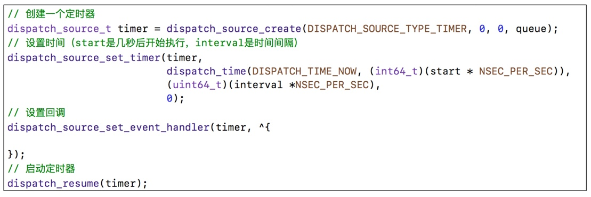
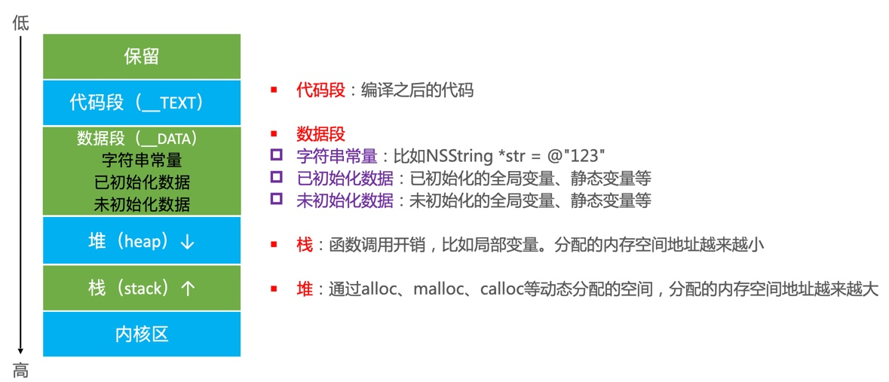
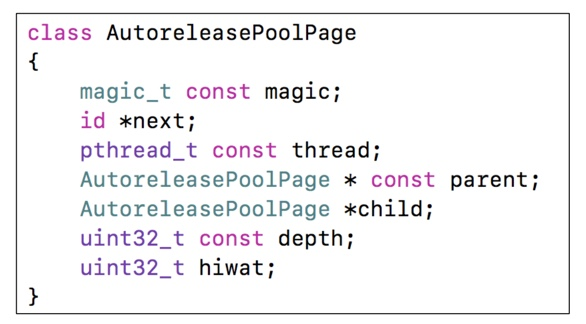
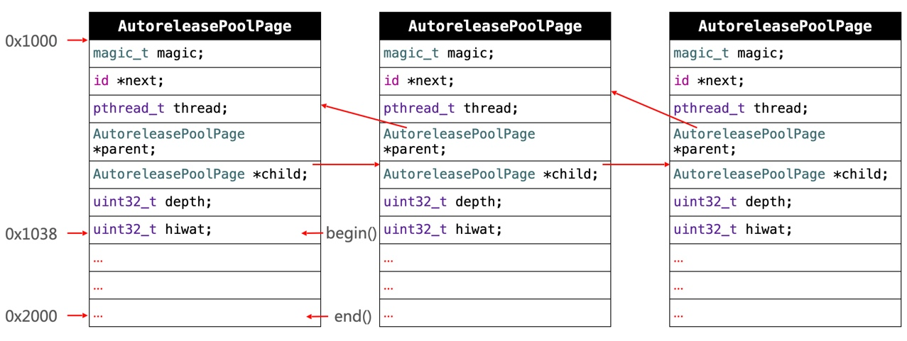

## 面试题

### 1、使用`CADisplayLink`、`NSTimer`有什么注意点？

* `CADisplayLink`、`NSTimer`会对`target`产生强引用，如果target又强引用了它们，就会引发循环引用；
* 解决方案：
	* 针对`NSTimer`，使用`block`初始化的方式（避免强引用`target`）
	* 使用`dispatch_source_t`取代`CADisplayLink`、`NSTimer`
	* 针对`CADisplayLink`和`NSTimer`，可以统一使用代理对象（继承自`NSProxy`）

**代理对象的使用方法：**

````c
// .h
@interface TimerProxy : NSProxy

+ (instancetype)timerProxyWithTarget:(id)target;

@end

//.m
@interface TimerProxy ()

@property (nonatomic, weak) id target;

@end

@implementation TimerProxy

+ (instancetype)timerProxyWithTarget:(id)target
{
    TimerProxy *proxy = [TimerProxy alloc];
    proxy.target = target;
    return proxy;
}

- (NSMethodSignature *)methodSignatureForSelector:(SEL)sel
{
    return [self.target methodSignatureForSelector:sel];
}

- (void)forwardInvocation:(NSInvocation *)invocation
{
    [invocation invokeWithTarget:self.target];
}

@end
````

**`CADisplayLink`、`NSTimer`准时吗？**

不准时的，二者都是依赖于`runloop`的，如果某次循环`runloop`执行的任务比较繁重，可能导致不准时。

**使用`GCD`的定时器：**

`GCD`的定时器是基于系统内核，更准时；



### 2、`NSObject`和`NSProxy`的区别

* 二者都是基类，且都实现了`NSObject`协议；
* 二者的消息转发机制不一样：
	* `NSObject`是自身的消息发送3大步；
	* `NSProxy`则是，如果没有实现具体的`sel`，会直接调用`-methodSignatureForSelector:`、`-forwardInvocation:`，由此可看出`NSProxy`是专门做消息转发的；
* 二者的定位不同
* `NSObject`可动态实现`-init`方法，`NSProxy`没有`-init`方法；

### 3、介绍内存的几大区域



### 4、讲一下你对`iOS`内存管理的理解

**`iOS`内存管理：**

* 在`iOS`中，使用 **引用计数** 来管理`OC对象`的内存：
	* 一个新创建的OC对象引用计数默认是`1`，当引用计数减为`0`，OC对象就会销毁，释放其占用的内存空间；
	* 调用`retain`会让OC对象的引用计数`+1`，调用`release`会让OC对象的引用计数`-1`；
* 除此之外，从64位开始，苹果又引入`Tagged Pointer`技术，对小对象（如NSNumber、NSDate、NSString）的存储进行了优化：
	* 也就是把小对象的数据直接存储在指针中，当指针不够存储时，才会使用动态分配内存的方式存储数据；
	* 如何判断一个指针是否为`Tagged Pointer`（使用`MASK`）：
		* iOS平台，最高有效位是1；
		* Mac平台，最低有效位是1；
* 使用`nonpointer_isa`对堆对象的指针进行了优化（详见[003_runtime.md](./003_runtime.md)） 

**引用计数的存储：**

在`64位`中，引用计数可以直接存储在优化过的`isa`指针中，也可能存储在`SideTable`类中；

````c
struct SideTable {
	spinlock_t slock;
	RefcountMap refcnts; // 存储着对象的引用计数
	weak_table_t weak_table; // 存储着对象的弱引用
};
````

**对象的释放：**

当一个对象要释放时，会自动调用`dealloc`，其核心流程如下：

* 如果该对象满足下列条件，直接`free`：
	* 是`nonpointer_isa`对象；
	* 没有`c++`析构函数；
	* 没有正在释放；
	* 没有关联对象;
	* 没有弱引用；
* 否则，要清除相应的（如c++析构函数、关联对象、弱引用）后，最后才会`free`

### 4、ARC帮我们做了什么？

`ARC`会在合适的位置添加对对象的内存管理方法（`retain`、`copy`、`release`等）

### 5、`weak`指针的实现原理

* 在`OC`运行时，有个全局的散列表，对象的弱引用就存储在其中；
* 当一个对象被弱引用引用时，会自动将其添加到该对象的弱引用表中，同时将该对象的`isa`指针中的用于标记是否有弱引用的位设置为1；
* 当一个对象被释放时，会自动调用该对象的`dealloc`方法来释放内存，其中就有对弱引用表的释放（如果有的话）

### 6、`autorelease`原理？`autorelease`对象在什么时机会被释放？

**`autorelease`原理：**

* 自动释放池的主要数据结构是：`__AtAutoreleasePool`、`AutoreleasePoolPage`，前者是个结构体，其内部包含了`AutoreleasePoolPage`变量，以及对该变量的构造、析构函数；
* 调用了`autorelease`的对象最终是通过`AutoReleasePoolPage`来管理的；

`AutoReleasePoolPage`核心结构如下：



说明如下：

* 每个`AutoreleasePoolPage`对象占用4096字节内存，除了用来存储它内部的成员变量（56字节），剩下的空间来存放`autorelease`对象的地址；
* 所有的`AutoreleasePoolPage`对象通过双链表的形式连接在一起；



* 调用`push`方法会将一个`POOL_BOUNDARY`入栈（哨兵对象），并返回其内存地址；
* 调用`pop`方法会传入一个`POOL_BOUNDARY`内存地址，会从最后一个入栈的对象开始发送`release`消息，直到遇到这个`POOL_BOUNDARY`
* 调用对象的`autorelease`方法会将该对象入栈；
* `id *next`指向了下一个能存放`autorelease`对象的地址；

可以通过以下私有函数来查看自动释放池的情况

````c
extern void _objc_autoreleasePoolPrint(void);
````

**`autorelease`对象的释放时机：**

`autorelease`对象的释放与`RunLoop`息息相关；

* `iOS`在主线程的`RunLoop`中注册了2个`Observer`：
	* 第1个`Observer`监听了`kCFRunLoopEntry`事件，会调用`objc_autoreleasePoolPush()`
	* 第2个`Observer`监听了：
		* `kCFRunLoopBeforeWaiting`事件，会调用`objc_autoreleasePoolPop()`、`objc_autoreleasePoolPush()`
		* `kCFRunLoopBeforeExit`事件，会调用`objc_autoreleasePoolPop()`

### 7、方法里有局部对象，出了方法后会立即释放吗？

这取决于`ARC`对该局部变量的处理，看添加的是`release`方法，还是`autorelease`方法：

* 如果是`release`方法，出了方法后会立即释放；
* 如果是`autorelease`方法，那么该对象会被加入自动释放池，其释放取决于`RunLoop`（调用`objc_autoreleasePoolPop()`）

